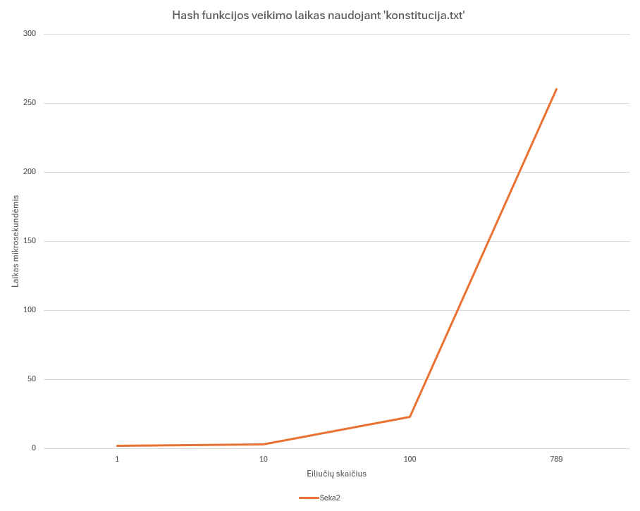

# Mano maišos funkcija „HashFun“: veikimo principai ir analizė

## Funkcijos paaiškinimas pseudokodu

**HashFun funkcija paima įvesties tekstą ir maišo jo baitus su aštuonių 64 bitų vidinių kintamųjų masyvu, atlikdama daugkartinius bitų poslinkius, XOR bei aritmetines operacijas. Po dviejų maišymo etapų ji sujungia gautas tarpines reikšmes į keturis 64 bitų blokus ir grąžina 256 bitų (64 simbolių šešioliktainį) maišos rezultatą.**

- Pradinė aštuonių 64 bitų registrų inicializacija su konstantomis

```cpp
FUNCTION HashFun(input_string):

h[0..7] ← {0x5FAF3C1BULL, 0x6E8D3B27ULL, 0xA1C5E97FULL, 0x4B7D2E95ULL, 0xF2A39C68ULL, 0x3E9B5A7CULL, 0x9D74C5A1ULL, 0x7C1A5F3EULL}
```

- Pagrindinis maišymas su kiekvienu įvesties simboliu

```cpp
FOR ind FROM 0 TO input_string.length − 1:
    c ← byte value of input_string[ind]
    i ← ind MOD 8
    h[i] ← h[i] XOR ( (h[(i+1) mod 8] << 7) OR (h[(i+7) mod 8] >> 3) )
    h[i] ← h[i] + (c * 131) + ( h[(i+3) mod 8] XOR h[(i+5) mod 8] )
```

- Papildomi 64 maišymo raundai be naujų duomenų

```cpp
FOR i FROM 0 TO 63:
    j ← i MOD 8
    h[j] ← h[j] XOR ( (h[(j+1) mod 8] << (i*7) MOD 61) OR (h[(j+7) mod 8] >> (i*5) MOD 53) )
    h[j] ← h[j] + ( h[(j+3) mod 8] XOR h[(j+5) mod 8] ) + (0x9E3779B97F4A7C15ULL XOR (i * 0xA1C52E95ULL))
```

- Išvesties suspaudimas į keturis galutinius 64 bitų žodžius

```cpp
FOR i FROM 0 TO 3:
        out4[i] ← h[i] XOR (h[i+4] << 1) XOR (h[(i+2) mod 8] >> 1)
```

- Sujungimas į vieną 256 bitų (64 hex) eilutę

```cpp
    hex_out ← format_as_16hex(out4[0]) || format_as_16hex(out4[1])
               || format_as_16hex(out4[2]) || format_as_16hex(out4[3])
    RETURN hex_out
END
```

## Eksperimentinis tyrimas

Šiame projekte tiriama mano sukurta HashFun. Tikslas – įvertinti jos savybes pagal užduoties reikalavimus.

---

## 1. Testinių failų paruošimas

Eksperimentams sukuriau kelis failus su skirtingu turiniu:

| Failo pavadinimas | Turinys                                                       |
|-------------------|---------------------------------------------------------------|
| `blank.txt`       | Tuščias failas                                                |
| `a.txt`           | Viena mažoji raidė **a**                                      |
| `b.txt`           | Viena mažoji raidė **b**                                      |
| `rnd100000.txt`   | 100 000 atsitiktinių simbolių (raidės, skaičiai, ženklai)     |
| `rnd1000000.txt`  | 1 000 000 atsitiktinių simbolių                               |
| `rndF100000.txt`  | 100 000 atsitiktinių simbolių                                 |
| `rndS100000.txt`  | Kaip rndF100000.txt, bet pakeistas 75 000-asis simbolis       |

## 2. Išvedimo dydis

Paleidau savo HashFun tuščiam failui, failui su a, failui su b ir failams su 100 000 bei 1 000 000 atsitiktinių simbolių. Kiekvienu atveju gauta 64 hex'ų eilutė. Tai atitinka 256 bitų ilgį ir įrodo, kad išvedimo dydis nepriklauso nuo įvesties.

| Failas          | Hash rezultatas                                                 |
|-----------------|-----------------------------------------------------------------|
| `blank.txt`     |e1e10ec33852dafdad0a90ef0edf56b9f7c1425813bc42d0a67386e5c1269b78 |
| `a.txt`         |13fbc56937664ae5ce4503508cf94ba6b82eaa19b9bc3c5bb8a7950b485df478 |
| `b.txt`         |0cce237961797622b9053b0d5e7c7c56848bcec8da55ef82c46496b265eee872 |
| `rnd100000.txt` |bf6fb7e57c24cee30ce7d062523997b2dcef0b49b1218c91dea9fca4751126f2 |
| `rnd1000000.txt`|afe953bc81c149bb814f8da11f69edd37b52b149d43643c1d85c4b5974b9c521 |

## 3. Deterministiškumas

Kiekvieną testinį failą hash’inau du kartus – rezultatai visada sutapo, todėl funkcija yra deterministinė.

Pavyzdys su `a.txt`, abu kartus gautas identiškas rezultatas:

13fbc56937664ae5ce4503508cf94ba6b82eaa19b9bc3c5bb8a7950b485df478
13fbc56937664ae5ce4503508cf94ba6b82eaa19b9bc3c5bb8a7950b485df478

Tas pats galioja visiems kitiems failams (`blank.txt`, `b.txt`, `rnd100000.txt`, `rnd1000000.txt`, `rndF100000.txt`, `rndS100000.txt`).

## 4. Efektyvumas

HashFun greitis buvo matuojamas naudojant `konstitucija.txt` failą. Matavau tik pačios hash funkcijos vykdymo laiką (be failo skaitymo) ir kiekvieną bandymą paleidau kelis kartus bei užrašiau vidutinę trukmę mikrosekundėmis.

| Įvedimo dydis (eilučių sk.) | Vidutinis veikimo laikas (µs)|
|-----------------------------|------------------------------|
| 1 eilutė                    | 2 µs                         |
| 10 eilučių                  | 3 µs                         |
| 100 eilučių                 | 23 µs                        |
| 789 eilučių (pilnas failas) | 260 µs                       |

Žemiau rezultatai pateikti naudojant grafiką:


## 5. Kolizijų paieška

Šiame etape patikrinau, ar mano sukurta HashFun sukuria skirtingus hash’us atsitiktinėms įvestims.

Iš pradžių papildžiau programos kodą, pridėdamas naujas funkcijas, kurios kartu generuoja po 100 000 atsitiktinių string porų, kiekvieną porą hash'uoja ir tikrina ar nebuvo identiškų hash'ų.

Poros generuotos keturių skirtingų ilgių: 10, 100, 500 ir 1000 simbolių, kiekvienam ilgiui atlikau po 3 bandymus, neaptikta ne vienos kolizijos:

| Ilgis (simbolių) | Bandymas 1 | Bandymas 2 | Bandymas 3 | Vidurkis |
|------------------|-----------:|-----------:|-----------:|---------:|
| 10               | 0          | 0          | 0          | **0**    |
| 100              | 0          | 0          | 0          | **0**    |
| 500              | 0          | 0          | 0          | **0**    |
| 1000             | 0          | 0          | 0          | **0**    |

## 6. Lavinos efektas

Lavinos efektas (avalanche effect) – tai testas, kuris parodo, kiek radikaliai pasikeičia rezultatas, jei įvestyje pakeičiame vieną simbolį.

Šiam testui sukuriau papildomą funkciją, kuri sugeneruoja 100 000 atsitiktinių porų, kurių kiekviena skiriasi tik vienu simboliu, hash'ina kiekvieną ir skaičiuoja skirtumus bitų bei hex simbolių lygmeniu.
Eksperimentas buvo atliktas su 100 simbolių ilgio poromis, kiekviena pora tik viena simbolio pakeitimu skyrėsi nuo kitos.

| Metrika   | Bitai (%)      | Hex’ai (%)     |
|-----------|----------------|----------------|
| Min       | 46.09 – 46.88  | 76.56 – 78.12  |
| Max       | 83.98 – 84.38  | 100            |
| Vidurkis  | 66.01 – 66.03  | 93.74 – 93.76  |

## 7. Negrįžtamumo demonstracija (hiding)

Patikrinti, ar pridėjus salt prie įvesties (`input + salt`) gaunamas maišos rezultatas neleidžia praktiškai atkurti pradinio input ir ar skirtingi salt'ai duoda skirtingus hash'us.

Žemiau pateikti eksperimento rezultatai rodo, kad tas pats pradinis tekstas, pridėjus skirtingus salt, generuoja visiškai skirtingus hash'us ir tai patvirtina hiding savybę. Be žinomo salt, atstatyti pradinį tekstą iš vieno hash'o praktiškai neįmanoma.

| Įvestis | Salt'as          | Hash'as                                                          |
|---------|------------------|------------------------------------------------------------------|
| pasword | pOOncF7F2H55pEUE | 80fcc33f8e238163bcae11570232e9ad310df28866cef2d0f54706b306051cbb |
| pasword | l76rLOoqthxPu8yC | ed0e2259fde8eaf65acc316b9016cefaf67e6d86dcd1aa18cbf3c71ed5a9368a |
| pasword | kjJ6snQ0I7X2MCWa | 2b009597db9415515ca8271ff7b9736e83616fe102c0dd98f3e6799705b4352c |
| 123     | r36gpAswUd8SOjHq | 4f3ebcd03e36c2397d701ea6b55989919547e1e92dafc31214353286503d37f2 |
| 123     | Wk5cQnko9EJ8FG5g | 9f53d30556cd21034ceb58e20a04aa572d3f140c224f2c161548cdcffeb1dcc9 |
| 123     | rCXApDNNxUTA4rOT | e45a2c0ef5e5439ec024cc6775d0ad9c2cdcc62e88bde93e367026f8f0f30485 |
| a       | AwnYSIuL6sWVHsfZ | 62ab3af5b0d3209781d3c4334cd98de8228fe13530f7472f1785e8e584ac4eac |
| a       | zC3V6kgK2EVbHe4E | 4491c9f51b7d8c1345ee3796933fa39af1ef507f1e6572ec9c19f8e7a0054b56 |
| a       | t7ggOCsebvov3fbQ | 564421f0695e1cb819a52d5fd16afbfdde3536a7dce978755f08497f28108847 |

## 8. Išvados

### Stipriosios pusės

- Funkcija visada grąžina 256 bitų (64 hex simbolių) rezultatą, nepriklausomai nuo įvesties.
- Deterministinė funkcija - ta pati įvestis visada duoda tą patį hash’ą.
- Vidutinis 66 % bitų pokytis rodo gerai veikianti lavinos efektą.
- 100 000 atsitiktinių porų įvairaus ilgio nepateikė nė vienos kolizijos.

### Silpnosios pusės

- Neištirtas kriptografinis atsparumas prieš atvirkštinę paiešką ar pasirinktas kolizijas.
- Nors veikimas greitas, nebuvo atlikti testai su itin dideliais (>GB) failais.
- Nepatikrintos standartinės kriptografinės atakos (diferencinė analizė, linijinė analizė).
- Reikalingi papildomi formalūs testai dėl saugumo ir stiprumo.
